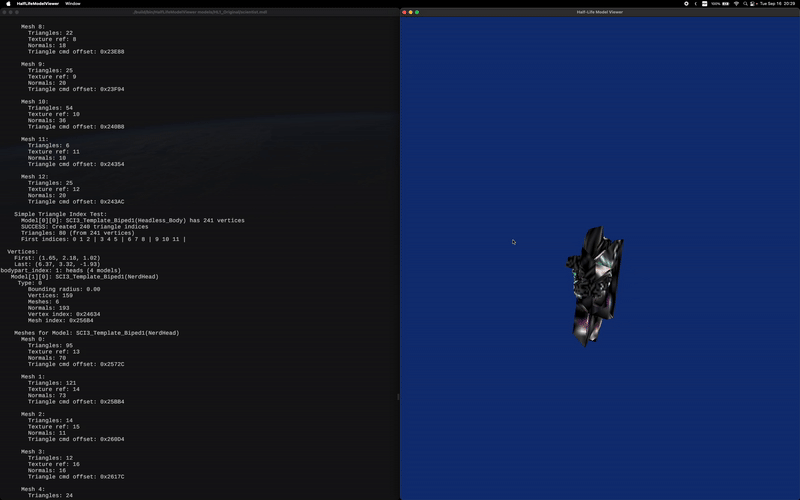

# Lambda

**A Professional Half-Life Studio Model Viewer and Editor**

Lambda is a cross-platform model viewer and editor for Half-Life 1 (GoldSource engine) Studio Models (.mdl). Built with a C backend and Qt6 frontend, it provides professional-grade visualization and inspection tools for Half-Life modding and development.

---

## Development Status

**Current Version:** v0.7.0-alpha

Lambda is under active development. Core model viewing and animation playback are fully functional. The following features are work-in-progress:

- Model editing capabilities
- QC decompiler / compiler integration
- Memory inspection panel
- Window layout management
- Some inspector panels (bone controllers values, hitbox editing)

The application is stable for model viewing and inspection. Editing features will be added in future releases.

---

## Table of Contents

- [Development Status](#development-status)
- [Overview](#overview)
- [Features](#features)
- [Screenshots](#screenshots)
- [System Requirements](#system-requirements)
- [Installation](#installation)
- [Build Instructions](#build-instructions)
- [Usage](#usage)
- [Keyboard Shortcuts](#keyboard-shortcuts)
- [Architecture](#architecture)
- [Project Structure](#project-structure)
- [Roadmap](#roadmap)
- [Changelog](#changelog)
- [Acknowledgments](#acknowledgments)
- [Contributing](#contributing)
- [License](#license)

---

## Overview

Lambda is designed to be a modern, feature-rich replacement for legacy Half-Life model viewers. Drawing inspiration from professional 3D tools and classic level editors such as Hammer, WorldCraft, TrenchBroom, Radiant, and BSP/Quake editors, Lambda aims to provide a familiar and powerful interface for the Half-Life modding community.

The project uses official Valve SDK structures (studio.h) and supports the complete Half-Life 1 Studio Model format (Version 10), including external texture files, sequence groups, and animation events.

### Current Version

**v0.7.0-alpha** (Build 16)

### Platform Support

| Platform | Status |
|----------|--------|
| macOS    | Fully Tested (Tahoe 26.0.1) |
| Linux    | Tested (Arch Linux 6.17.3) |
| Windows  | Planned |

---

## Features

### Model Loading and Parsing

- Complete MDL file loading with full studiohdr_t parsing
- External texture file support (T.mdl companion files)
- Sequence group loading (external .mdl01, .mdl02, etc.)
- Bodypart and submodel management
- Skin family (texture variant) support
- Bone hierarchy with up to 128 bones
- Hitbox data parsing
- Attachment point parsing
- Bone controller parsing

### Rendering

- OpenGL 3.3+ rendering pipeline
- Real-time textured model rendering
- Wireframe rendering mode
- Point rendering mode
- Ground grid display
- Coordinate axis gizmo
- Compass orientation display
- Rotation gizmos
- Configurable background color
- Multi-sample anti-aliasing (MSAA)

### Animation System

- Full animation playback with bone transformations
- Sequence selection and cycling
- Play/pause/stop controls
- Frame stepping (forward/backward)
- Playback speed control
- Animation looping toggle
- Frame interpolation for smooth playback
- Animation event detection and processing

### Audio System

- Animation event-driven sound playback
- WAV file format support
- Sound directory auto-detection
- Valve directory fallback system (valve_hd to valve)
- Sound variant support (numbered sound files)
- Audio toggle control

### Camera System

- Orbital camera with rotation around model
- Mouse drag rotation
- WASD keyboard movement
- Zoom controls (Q/E keys and scroll wheel)
- Camera reset functionality
- Raycasting camera support

### GUI Editor (LambdaEditor)

- Qt6-based professional interface
- Dark theme with classic editor aesthetics
- Dock-based panel layout
- Multi-tab model viewing
- Toolbar with quick-access controls

#### Inspector Panels

- **Model Info Panel** - Statistics, metadata, and model properties
- **Sequences Panel** - Animation browser with playback controls
- **Textures Panel** - Texture viewer with full-size display
- **Bodyparts Panel** - Bodypart and submodel selection
- **Bones Panel** - Bone hierarchy viewer
- **Bone Controllers Panel** - Controller value adjustment (WIP)
- **Attachments Panel** - Attachment point inspection
- **Model Display Panel** - Render mode toggles
- **Lighting Panel** - Lighting configuration
- **Memory Panel** - Memory inspection (Planned)
- **Hitboxes Panel** - Hitbox editing (Planned)

#### Additional Widgets

- **Console Widget** - Command output and logging
- **Log Widget** - Detailed logging with filtering
- **Status Bar** - FPS, CPU, GPU, RAM, camera position, grid state
- **Browser Panel** - File browser for model selection

### Command-Line Interface

- `--help` - Display usage information
- `--version` - Show version details
- `--dump` - Output model structure summary
- `--dump-ex` - Extended structure dump with raw data
- `--dump-only` - Dump and exit without viewer
- `--quiet` - Suppress non-error output

### Developer Features

- Comprehensive logging system with categories
- Debug, Info, Warn, Error, and Trace log levels
- Git commit and branch information in builds
- Semantic versioning
- Configurable feature flags

---

## Screenshots




Additional screenshots will be added as development progresses.

---

## System Requirements

### Minimum Requirements

- **OS**: macOS 10.15+, Linux (X11), Windows 10 (planned)
- **CPU**: Any x86_64 or ARM64 processor
- **RAM**: 256 MB
- **GPU**: OpenGL 3.3 compatible graphics
- **Disk**: 50 MB free space

### Recommended Requirements

- **RAM**: 512 MB or more
- **GPU**: Dedicated graphics with OpenGL 4.1+
- **Display**: 1920x1080 or higher

---

## Installation

### macOS (Homebrew)

```bash
# Install dependencies
brew install glfw glew qt

# Clone the repository
git clone https://github.com/KarloSiric/Lambda.git
cd Lambda

# Build
mkdir build && cd build
cmake ..
make -j$(sysctl -n hw.ncpu)

# Run CLI viewer
./bin/Lambda /path/to/model.mdl

# Run GUI editor
./bin/LambdaEditor
```

### Linux (Arch Linux)

```bash
# Install dependencies
sudo pacman -S glfw-x11 glew qt6-base qt6-tools cmake

# Clone and build
git clone https://github.com/KarloSiric/Lambda.git
cd Lambda
mkdir build && cd build
cmake ..
make -j$(nproc)
```

### Linux (Debian/Ubuntu)

```bash
# Install dependencies
sudo apt install libglfw3-dev libglew-dev qt6-base-dev cmake build-essential

# Clone and build
git clone https://github.com/KarloSiric/Lambda.git
cd Lambda
mkdir build && cd build
cmake ..
make -j$(nproc)
```

---

## Build Instructions

### Prerequisites

| Dependency | Version | Purpose |
|------------|---------|---------|
| CMake      | 3.15+   | Build system |
| OpenGL     | 3.3+    | Rendering API |
| GLFW       | 3.3+    | Window management |
| GLEW       | 2.0+    | OpenGL extension loading |
| Qt6        | 6.2+    | GUI framework (optional) |

### Build Options

```bash
# Release build (default)
cmake -DCMAKE_BUILD_TYPE=Release ..
make

# Debug build
cmake -DCMAKE_BUILD_TYPE=Debug ..
make

# Build without Qt GUI (CLI only)
cmake -DQt6_DIR="" ..
make
```

### Build Targets

| Target | Description |
|--------|-------------|
| `Lambda` | CLI model viewer |
| `LambdaEditor` | Qt6 GUI editor (requires Qt6) |
| `run` | Build and run Lambda |
| `version` | Display version information |
| `clean-all` | Remove entire build directory |

---

## Usage

### CLI Viewer

```bash
# Basic usage
./Lambda model.mdl

# Dump model info
./Lambda model.mdl --dump

# Extended dump
./Lambda model.mdl --dump-ex

# Dump and exit
./Lambda model.mdl --dump-only

# Quiet mode (errors only)
./Lambda model.mdl --quiet
```

### GUI Editor

```bash
# Launch editor
./LambdaEditor

# Open model via File menu or drag-and-drop
```

---

## Keyboard Shortcuts

### Camera Controls

| Key | Action |
|-----|--------|
| W/A/S/D | Move camera |
| Q/E | Zoom out/in |
| R | Reset camera |
| Mouse Drag | Rotate view |
| Scroll Wheel | Zoom |

### Animation Controls

| Key | Action |
|-----|--------|
| Space | Play/Pause animation |
| Left/Right Arrow | Previous/Next sequence |
| Up/Down Arrow | Change skin family |
| L | Toggle looping |
| 0 | Reset to frame 0 |
| I | Display animation info |

### Bodypart Controls

| Key | Action |
|-----|--------|
| [ / ] | Previous/Next bodypart |
| - / = | Previous/Next submodel |
| B | Show bodypart info |
| Backspace | Reset all bodyparts |

### Render Modes

| Key | Action |
|-----|--------|
| F | Toggle wireframe |
| P | Toggle points |
| G | Toggle grid |
| N | Toggle normals |
| H | Toggle hitboxes |
| T | Toggle attachments |

### Audio

| Key | Action |
|-----|--------|
| M | Toggle audio |

---

## Architecture

Lambda uses a dual-architecture design with a C backend and Qt6 frontend:

```
                    +------------------+
                    |   LambdaEditor   |
                    |   (Qt6 C++ GUI)  |
                    +--------+---------+
                             |
                    +--------v---------+
                    |  Bridge Layer    |
                    | (C/C++ interface)|
                    +--------+---------+
                             |
    +------------------------+------------------------+
    |                        |                        |
+---v---+              +-----v-----+            +-----v-----+
|  MDL  |              |  Renderer |            |   Math    |
| Parser|              |  (OpenGL) |            |  Library  |
+-------+              +-----------+            +-----------+
    |                        |                        |
+---v---+              +-----v-----+            +-----v-----+
| Audio |              |   Input   |            |  Utility  |
| System|              |  Handler  |            | Functions |
+-------+              +-----------+            +-----------+
```

### Design Philosophy

1. **C Backend** - All core logic (MDL parsing, rendering, math) is written in portable C99
2. **Qt Frontend** - GUI layer uses Qt6 for professional cross-platform interface
3. **Separation of Concerns** - Clean module boundaries with explicit interfaces
4. **Instance-based Rendering** - Supports multiple viewports with independent state

---

## Project Structure

```
Lambda/
+-- src/
|   +-- main.c                 # CLI entry point
|   +-- studio.h               # Valve SDK structures
|   +-- version.h              # Version information
|   +-- platform.h             # Platform detection
|   |
|   +-- cl/                    # Client application
|   |   +-- cl_app.c/h         # App lifecycle
|   |   +-- cl_app_init.c/h    # Initialization
|   |   +-- cl_app_config.c/h  # Configuration
|   |
|   +-- mdl/                   # MDL format handling
|   |   +-- mdl_loader.c/h     # File loading
|   |   +-- mdl_animations.c/h # Animation system
|   |   +-- mdl_bones.c/h      # Bone hierarchy
|   |   +-- mdl_sequences.c/h  # Sequence management
|   |   +-- mdl_bodypart.c/h   # Bodypart system
|   |   +-- mdl_audio.c/h      # Audio events
|   |   +-- mdl_hitboxes.c/h   # Hitbox data
|   |   +-- mdl_attachments.c/h# Attachment points
|   |   +-- ...
|   |
|   +-- r/                     # Rendering subsystem
|   |   +-- r_draw.c/h         # Main renderer
|   |   +-- r_camera.c/h       # Camera system
|   |   +-- r_textures.c/h     # Texture management
|   |   +-- r_grid.c/h         # Ground grid
|   |   +-- r_gizmo.c/h        # Rotation gizmos
|   |   +-- r_compass.c/h      # Orientation compass
|   |
|   +-- math/                  # Math library
|   |   +-- math_vector.c/h    # Vector operations
|   |   +-- math_matrix.c/h    # Matrix operations
|   |   +-- math_quaternion.c/h# Quaternion operations
|   |   +-- math_angles.c/h    # Angle conversions
|   |
|   +-- input/                 # Input handling
|   +-- util/                  # Utilities (logger, console, etc.)
|   +-- shaders/               # GLSL shaders
|   |
|   +-- editor/                # Qt6 GUI (C++)
|       +-- main.cpp           # Qt entry point
|       +-- MainWindow.cpp/h   # Main window
|       +-- EditorConfig.h     # Configuration
|       +-- panels/            # UI panels
|       +-- widgets/           # Custom widgets
|       +-- menus/             # Menu factories
|       +-- toolbars/          # Toolbar factories
|       +-- bridge/            # C/Qt bridges
|       +-- theme/             # Theme management
|
+-- shaders/                   # Shader files
+-- resources/                 # Qt resources (icons)
+-- external/                  # Third-party libraries
+-- docs/                      # Documentation
+-- models/                    # Test models
+-- CMakeLists.txt             # Build configuration
+-- CHANGELOG.md               # Version history
+-- ROADMAP.md                 # Development roadmap
+-- LICENSE                    # Project licenses
```

---

## Roadmap

### Current Phase (v0.7.x)

- Inspector panel refinements
- Multi-tab model viewing
- Icon and toolbar improvements
- Camera and movement enhancements

### Planned Features

#### Visualization
- Hitbox rendering with color-coded hit groups
- Bone skeleton visualization
- Attachment point gizmos
- Sequence bounding boxes
- Normal vector display
- UV coordinate overlay

#### GUI Improvements
- Animation timeline with event markers
- Bone controller sliders
- Texture export functionality
- Screenshot tool with transparency support
- Model comparison view
- Preferences dialog

#### Export and Tools
- QC file generation (decompiler)
- Texture batch export
- Model statistics report
- Command-line batch operations

#### Platform
- Windows build and installer
- Linux AppImage distribution
- macOS DMG installer

See [ROADMAP.md](ROADMAP.md) for the complete development roadmap.

---

## Changelog

**v0.7.0** (Current) - Inspector panel system, rotation gizmos, compass, viewport improvements

**v0.4.0** - Audio system, skin families, sound directory fallback

**v0.3.0** - Math library, performance optimizations

**v0.2.0** - Linux platform support

**v0.1.0** - Initial release with model loading, rendering, animation

See [CHANGELOG.md](CHANGELOG.md) for complete version history with all changes.

---

## Acknowledgments

Lambda would not be possible without the contributions and inspiration from the following:

### Code and Technical Reference

- **Sam Vanheer** - Creator of [Half-Life Asset Manager (HLAM)](https://github.com/SamVanheer/HalfLifeAssetManager) and [HalfLifeModelViewer2](https://github.com/SamVanheer/HalfLifeModelViewer2). His work provided invaluable reference for understanding the MDL format, UI/UX patterns, and implementation approaches. HLAM set the standard for Half-Life asset management tools.

- **Valve Corporation** - For the original Half-Life SDK and studio.h header defining the model format.

- **Id Software** - For the foundational Id Technology that Half-Life was built upon.

### Inspiration

The visual design and workflow of Lambda draws inspiration from classic level editors that defined an era of game development:

- **Hammer Editor / WorldCraft** - Valve's official level editor
- **TrenchBroom** - Modern Quake map editor
- **GtkRadiant / NetRadiant** - Id Tech engine editors
- **BSP/Quake editors** - Original BSP editing tools
- **J.A.C.K.** - Jackhammer level editor

### Community

- **Half-Life Modding Community** - For keeping the GoldSource engine alive and providing feedback
- **TWHL (The Whole Half-Life)** - Community knowledge base and tutorials
- **Sven Co-op Team** - GoldSource engine expertise

### Libraries

- [GLFW](https://www.glfw.org/) - Window and input management
- [GLEW](http://glew.sourceforge.net/) - OpenGL extension loading
- [Qt](https://www.qt.io/) - GUI framework
- [CGLM](https://github.com/recp/cglm) - Math library foundation
- [miniaudio](https://miniaud.io/) - Audio playback

---

## Contributing

Contributions are welcome. Please follow these guidelines:

1. Fork the repository
2. Create a feature branch (`git checkout -b feature/your-feature`)
3. Follow the existing code style (see `docs/` for conventions)
4. Test your changes on macOS (primary platform)
5. Submit a pull request with a clear description

### Code Style

- C code: C99 standard, snake_case naming, module prefixes
- C++ code: C++17 standard, Qt conventions
- See project memories for detailed style guide

### Reporting Issues

When reporting bugs, please include:
- Operating system and version
- GPU and OpenGL version
- Steps to reproduce
- Model file (if applicable)
- Log output (`logs/` directory)

---

## License

This project contains multiple components under different licenses:

| Component | License | Commercial Use |
|-----------|---------|----------------|
| Lambda Editor Code | MIT | Yes |
| Valve SDK Components (studio.h) | Valve SDK | Non-commercial only |
| Id Technology | Id Software | Non-commercial only |

**Important:** Due to the inclusion of Valve SDK structures for MDL format support, the complete application is restricted to non-commercial use unless explicit permission is obtained from Valve LLC.

Lambda editor code is Copyright (c) 2025 Karlo Siric under the MIT License.

Valve SDK components are Copyright (c) 1996-2002 Valve LLC. This product contains software technology licensed from Id Software, Inc.

See [LICENSE](LICENSE) for complete license terms and third-party library attributions.

---

**Lambda** - Professional Half-Life Model Viewer and Editor

[Report Bug](https://github.com/KarloSiric/Lambda/issues) | [Request Feature](https://github.com/KarloSiric/Lambda/issues) | [Documentation](docs/)
